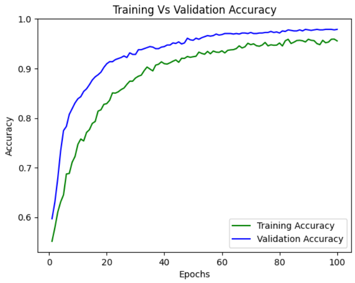
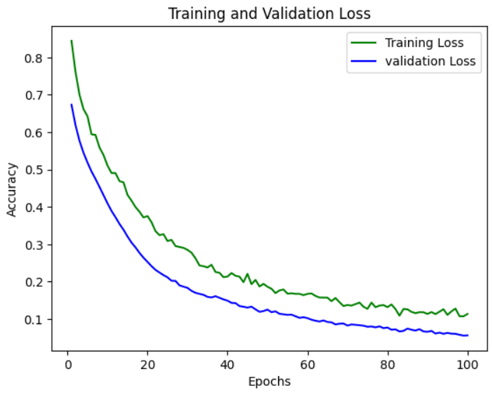

# Proyecto Final: Parte 1
---

## Table of Contents

- [Introducción](#introducción)
- [Pipeline](#pipeline)
    * [EDA](#eda)
    * [Entrenamiento](#entrenamiento)
    * [Evaluación](#evaluación)
- [Pasos de ejecución de Docker](#pasos-de-ejecución-de-docker)
- [Monitoreo con cAdvisor](#monitoreo-con-cadvisor)
- [Makefile](#makefile)

## Resumen
La creación de modelos anti-spoofing ha adquirido una relevancia fundamental en el contexto actual de avances tecnológicos y dependencia creciente de sistemas biométricos para la autenticación de identidad. En un mundo donde la seguridad de la información y la protección de datos personales son prioridades ineludibles, la autenticación biométrica se ha convertido en una herramienta crucial. Sin embargo, esta tecnología no está exenta de desafíos, y uno de los más prominentes es la amenaza de ataques de spoofing, donde individuos malintencionados intentan engañar a los sistemas biométricos mediante el uso de réplicas o datos falsos.

Los modelos anti-spoofing desempeñan un papel esencial al abordar esta vulnerabilidad, buscando mitigar los riesgos asociados con la manipulación fraudulenta de sistemas biométricos. Al desarrollar y perfeccionar estos modelos, se contribuye significativamente a la construcción de un entorno digital más seguro y confiable. La importancia de estos modelos no solo radica en la protección de datos sensibles, sino también en la preservación de la integridad de sistemas que confían en la verificación biométrica, como el acceso a dispositivos, servicios financieros y la gestión de la identidad en diversos sectores. En este sentido, la investigación y aplicación de modelos anti-spoofing no solo representan un avance tecnológico, sino también un compromiso con la salvaguarda de la autenticidad y la confianza en un mundo cada vez más interconectado.

## Pipeline
### EDA
El conjunto de imágenes se encuentra divido de la siguiente manera:
* Dataset de Entrenamiento (4220 imágenes)
    * 2102 imágenes son reales
    * 2118 imágenes son spoofing
* Dataset de Testo (951 imágenes)
    * 477 imágenes son reales 
    * 474 imágenes son spoofing

Podemos observar las imágenes que se están utilizando para entrenamiento:


Podemos observar las imágenes que se están utilizando para testeo:


### Entrenamiento
Para el desarrollo del modelo anti-spooging se utiliza **MobileNetV2** con los weights de **Imagenet**.

<details>
<summary>
Librerías utilizadas
</summary>

```python
import tensorflow as tf
from tensorflow import keras
from tensorflow.keras.layers import Dense,Dropout,Input,Flatten
from tensorflow.keras.models import Model
from tensorflow.keras import models
from tensorflow.keras.preprocessing.image import ImageDataGenerator
from tensorflow.keras.callbacks import ModelCheckpoint
from tensorflow.keras.applications.mobilenet_v2 import MobileNetV2
from tensorflow.keras.models import model_from_json
import json
import os
import matplotlib.pyplot as plt
```
</details>


<details>
<summary>
Datos
</summary>

```python
dataset_dir = 'dataset'
train_dir = 'dataset/train'
test_dir = 'dataset/test'

train_datagen = ImageDataGenerator(brightness_range=(0.8,1.2), rotation_range=30, width_shift_range=0.2,
                                    height_shift_range=0.2, fill_mode='nearest', shear_range=0.2, 
                                    zoom_range=0.3, rescale=1./255)
valid_datagen = ImageDataGenerator(rescale=1./255)

train_generator = train_datagen.flow_from_directory(train_dir,target_size=(160,160),color_mode='rgb',
                                                    class_mode='binary',batch_size=BATCH_SIZE,shuffle=True)
valid_generator = valid_datagen.flow_from_directory(test_dir,target_size=(160,160),color_mode='rgb',
                                                    class_mode='binary',batch_size=BATCH_SIZE)
```
</details>

<details>

<summary>
Modelo MobileNetV2
</summary>

```python
mobilenet = MobileNetV2(weights="imagenet",include_top=False,input_tensor=Input(shape=(160,160,3)))
mobilenet.trainable = False
output = Flatten()(mobilenet.output)
output = Dropout(0.3)(output)
output = Dense(units = 8,activation='relu')(output)
prediction = Dense(1,activation='sigmoid')(output)
model = Model(inputs = mobilenet.input,outputs = prediction)
```
</details>

<details>
<summary>
Entrenamiento
</summary>

```python
model.compile(
  loss='binary_crossentropy',
  optimizer=tf.keras.optimizers.Adam(
    learning_rate=0.000001,
    beta_1=0.9,
    beta_2=0.999,
    epsilon=1e-07
),
  metrics=['accuracy']
)

history = model.fit_generator(
    train_generator,
    steps_per_epoch = train_generator.samples // 25,
    validation_data = valid_generator, 
    validation_steps = valid_generator.samples // 25,
    epochs = 100,
    callbacks=[model_checkpoint],
    workers = 10)
```
</details>

<details>
<summary>
Guardar modelo
</summary>

```python
model_json = model.to_json()
with open("antispoofing_models/antispoofing_model.json", "w") as json_file:
    json_file.write(model_json)
```
</details>

### Evaluación

### Training vs Validation Accuracy



### Training and Validation Loss



## Pasos de ejecución de Docker

Para la ejecución de la imagen utilizamos el archivo Makefile que contiene los comandos necesarios para realizar Build y Run al script check_faces.py.

[Dockerfile](https://github.com/JohanTv/CloudComputing-ProyectoFinal/blob/main/Dockerfile)

Build Image
```Makefile
make build_image
```
Run Image
```Makefile
make run
```
Run check_faces.py
```Makefile
make run_script
```
Run notebooks
```Makefile
make run_jupyter
```
Remove Image
```Makefile
make remove_image
```
## Monitoreo con cAdvisor
Para ejecutar el cAdvisor y observar los recursos utilizados es necesario usar el siguiente comando:
```Makefile
make run_cadvisor
```


## Makefile
El archivo contiene los comandos necesarios para construir, ejecutar y remover la imagen, y usar los notebooks del modelo.

[Makefile](https://github.com/JohanTv/CloudComputing-ProyectoFinal/blob/main/Makefile)

